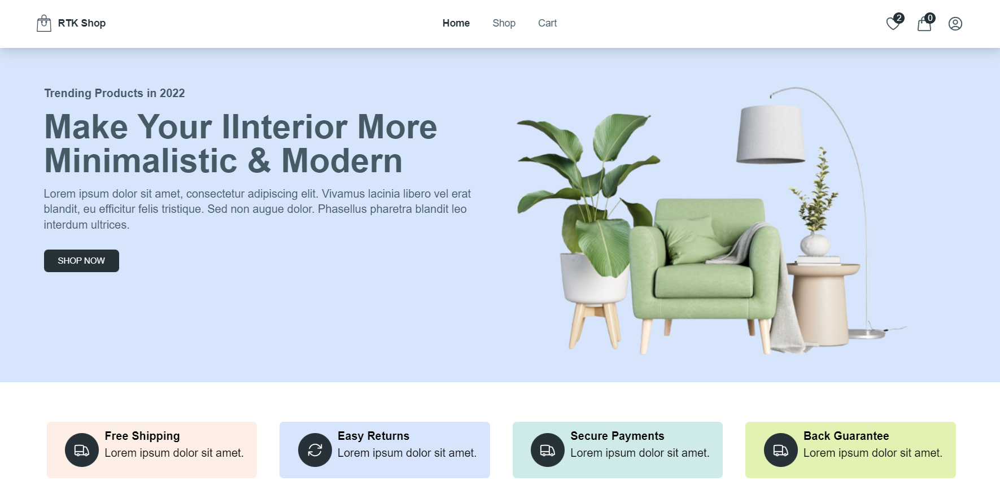

 

  

  <h3 align="center">RTK-Shop</h3>

  

    An Awesome Stater React E-commerce Website!
     
     
    <a href="https://github.com/Janitherange/rtk-shop"><strong>Explore the docs »</strong></a>
     
     
    <a href="https://github.com/Janitherange/rtk-shop">View Demo</a>
    .
    <a href="https://github.com/Janitherange/rtk-shop/issues">Report Bug</a>
    .
    <a href="https://github.com/Janitherange/rtk-shop/issues">Request Feature</a>
  

    

## Table Of Contents

* [About the Project](#about-the-project)
* [Built With](#built-with)
* [Getting Started](#getting-started)
  * [Prerequisites](#prerequisites)
  * [Installation](#installation)
* [Roadmap](#roadmap)
* [Contributing](#contributing)
* [License](#license)
* [Authors](#authors)
* [Acknowledgements](#acknowledgements)

## About The Project

## Built With

RTK-Shop is built using React Library and Firebase backend

## Getting Started

To Start the project Run `npm run dev`
To get a local copy up and running follow these simple example steps.

### Prerequisites

This is an example of how to list things you need to use the software and how to install them.

* npm

`npm install npm@latest -g`

### Installation

1. Create firebase project and obtain API Keys

2. Clone the repo

`git clone https://github.com/Janitherange/rtk-shop.git`

3. Install NPM packages

`npm install`

4. create an environment variable file called `.env`

`VITE_FIREBASE_API_KEY='ENTER YOUR CONFIG'
VITE_FIREBASE_AUTH_DOMAIN='ENTER YOUR CONFIG'
VITE_FIREBASE_STORAGE_BUCKET='ENTER YOUR CONFIG'
VITE_FIREBASE_MESSAGE_SENDER_ID='ENTER YOUR CONFIG'
VITE_FIREBASE_APP_ID='ENTER YOUR CONFIG'`

## Roadmap

See the [open issues](https://github.com/Janitherange/rtk-shop/issues) for a list of proposed features (and known issues).

## Contributing

Contributions are what make the open source community such an amazing place to be learn, inspire, and create. Any contributions you make are **greatly appreciated**.
* If you have suggestions for adding or removing projects, feel free to [open an issue](https://github.com/Janitherange/rtk-shop/issues/new) to discuss it, or directly create a pull request after you edit the *README.md* file with necessary changes.
* Please make sure you check your spelling and grammar.
* Create individual PR for each suggestion.
* Please also read through the [Code Of Conduct](https://github.com/Janitherange/rtk-shop/blob/main/CODE_OF_CONDUCT.md) before posting your first idea as well.

### Creating A Pull Request

1. Fork the Project
2. Create your Feature Branch (`git checkout -b feature/AmazingFeature`)
3. Commit your Changes (`git commit -m 'Add some AmazingFeature'`)
4. Push to the Branch (`git push origin feature/AmazingFeature`)
5. Open a Pull Request

## License

Distributed under the MIT License. See [LICENSE](https://github.com/Janitherange/rtk-shop/blob/main/LICENSE.md) for more information.

## Authors

* **Janith Eranga** - *Comp Sci Student* - [Janith Eranga](https://github.com/Janitherange) - *Built RTK-Shop Website*

## Acknowledgements

* [Janitherange](https://github.com/Janitherange)

 
